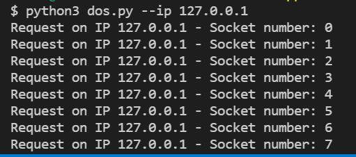

# Our App Technology
We built our app in two famous Web Technology: Front-end and Back-end .
## Front-end Web Technology
We built our app using Bootstrapp technology framework, i.e, this is called some time all-in-one technology (HTML5, CSS3 and JavaScript).
## Back-end Web Technology
We built our app using PHP, Mysql for DB and PHPmyadmin to create and import quickly the databases . Furthermore, we use redis DB to create a cache for one of the types the Vulnerabilities.

# Vulnerabilities

# 1. CWE 89 - Improper Neutralization of Special Elements used in an SQL Command ('SQL Injection')

The vulnerability CWE 89 represents the abusive use of a vulnerable field to perform SQL attacks on a database.

The attacker, through the misuse of such a "vulnerable" field, is able to execute commands directly to the system's database, having access to resources that a normal user would not have.

To show how it works, we made a vulnerable field on ```profile.php```.

## The funcionality:

The user can perform a search for the book that he wants just by using the field for it, like the next image:

When the user presses the button "search", a query will go to the database and search for a book that has the same ```id``` number inserted on the field.

After the return of the query, if there is any book added by him with that ```id```, he will get this:


## The vulnerability:

The field used to perform his search can only accept numbers because the search is working by the ```id``` number of each book, so when the query goes to the database with SQL commands and if they are written correctly like ```' UNION SELECT user_name, user_email, user_pass, user_type, NULL FROM users --  //``` they will be executed in the database and return data that are not suposed to be returned for the user.

This query needs to have a ```NULL``` field because the table only supports 4 fields (ex: ```user_name, user_email, user_pass, user_type```) and will have a fifth field that would have an "Edit" button, so we will need to fill that with the ```NULL``` value. The attacker needs to seek for the important fields that he wants to see and to get some advantage of them.

When a field like this is vulnerable, an attacker can insert unwanted code, resulting in major problems to the database like delleting data, adding data or even see some "secret" data, as shown in the following image:


## The fix:

In order to keep the integrity of the database, we made some corrections in our application by using the method ```$connection->prepared()``` from the object PDO (object responsable for the connection to the database), that prevents SQLInjection attacks by eliminating the need to manually quote and escape parameters. Later on the parameters that need to be sent to the database are binded to the query with the ```$connection->execute(array($param1, $param2, ..))``` method, combined with ```htmlspecialchars()``` method that will sanitize the data inserted.

All this said before is performed in ```book_query.php```, but the data is shown on ```profile.php``` and the data sent by this page to the ```book_query.php``` file needed also needed to be verified, so we use Regex as a way to avoid entering data other than numbers.

From the expression ```/^\d+$/```, that represents that the field can only recieve a value with one or more numbers on it, we can prevent inproper data to enter our query and perform malicious acctions in the application. With this expression and using the method ```$expression.text($string)```, we get back a boolean value corresponding "true" if the string inserted matches the requirements on the expression (sending the data to the ```book_query.php```) and "false" if the string contains other type of caracters (replying with a notification message saying that the user inserted unproper data on the field).

The result of the combination between the PDO object and is methods and a simple Regex expression results in a page protected from SQLInjection attacks, like the following image:


# 2. CWE 79 - Improper Neutralization of Input During Web Page Generation ('Cross-site Scripting')

The CWE 79 weakness can be explored when the software does not sanitize input before it is used in a web page that is presented to others.

There are several types of XSS (Cross Site Scripting) but the one we are working with is the Stored XSS, since the unauthorized code is stored on the server side.

To demonstrate this, there have been created several files, in wich there is a page to add a book, and there is a page to show all books added.

## The functionality:

The user can insert a book record, to do this he must go to the add page, as shown in the image:


When an user is about to fill the data for inserting a book, he is prompted with the fields shown in the next image:


By pressing "submit", the book information is sent to the database inserting the book so that it can later be shown.

To see the book entry, the user must go to the home page like so:


## The vulnerability:

When filling the prompted fields, they accept not only letters but also special characters, since they are sometimes needed for proper and correct book insertion, when this happens, if the user tries to fill in some html tags, they are sent to the database, when a user goes to the home page to see the colection of books added, the html tags previously inserted are now loaded and the client browser parses them, executing the inserted code, this can result in the execution of unwanted and unauthorized code, this can be used for many porposes like atacking the user who opened the page, or to run simple scripts on the web page, like this example:


## The execution

To exploit the following vunerability, first login into any active user, secondly head to the book adding page at ``` app/book_add.php ```, start by filling the name field with a valid name, on the author field you can insert anything that have active html flags, for example ``` <script>alert("XSS")</script> ```, it is important to note that the max string length for this field is 45, if the string sent to the database is bigger than this, the record will not be registered.

After the correct insertion, it is now possible to go into the home page at ``` app/home.php ``` and verify if the data inserted is being executed, like so:


## The fix:

The fix to Cross Site Scripting is starightforward in our application since the potential unauthorized code presented to the user is inserted in the database and later shown in the home page, and to fix this two sanitizing procedures are in place, one when the code is sent to the database, and one where the code is presented to the user, this approach is useful for 2 reasons, first there may be other apps connected to the same database in the future, if an app is not secure it can insert unsanitised code to the database, and we sanitise it when showing it to the user, so that type of attach takes no effect, secondly there may be other apps showing the same information of this same database, so when our app inserts data into the database, by sanitizing it before hand we prevent that the users of the other app (that may be insecure) are atacked.

In the following lines, we use the ```htmlspecialchars()``` function to sanitize the data inserted to the database, where, per example, characters like ```<``` are escaped to ```&lt;```.

Likewise, when the request is sent to the server, this retrieves data from the database and sanitizes it with ```htmlspecialchars()``` so that it comes inactive and can't run unauthorized code. 

To verify if the fix is working, please follow the steps shown on "The Vulnerability" to verify if the data is being parsed or if it is being correctly sanitized, like so:


# 3. CWE 400 - Uncontrolled Resource Consumption

In an application that lacks control over resource allocation, an attacker or zombies controlled by it may use server resources anomalously.

Sometimes preventing the server from responding to users at normal speed or in the worst case blocking all communication, this attack is called a denial of service.

If this attack is done with distributed and synchronized devices we can call it DDoS.

Today, the record for a DDoS attack is on the order of 1 terabyte per second, due to the evolution of the Internet of Things and the exponential increase in associated devices.


###### DOS and DDOS Attack

## The functionality:

There are certain user interactions with the application, where information is stored in a database.

When he tries to access the page without being logged in, he is taken to an authentication page.

The server used to host the application is relevant to the strategy, in this case the attack is directed at Apache (31.5% of web servers), this type of server opens a thread whenever a client makes a request, if we occupy all available threads during for an indefinite period, we consume all the resources that the server has to respond to its clients, triggering anomalous behavior.

## The vulnerability:

Denial of service attacks typically flood the server with as much data as possible.

In exploiting this vulnerability we used a strategy similar to SlowLoris DOS ```https://github.com/gkbrk/slowloris```, the intention is to make the attack more effective.

An HTTP GET request follows a well-defined communication scheme, typically uses port 80, sends associated content to the browser (user-agent), followed by the protocol ```HTTP/1.1``` and two line breaks ```\n\n``` to complete the call.


###### SlowLoris DOS

Assuming that the server will never receive the double-line break can cause it to wait indefinitely for the rest of the request, this will cause the server to have reduced communication speeds or no longer be able to communicate.

As long as the server has all its threads communicating with the script, the web server will not respond to any other GET requests from other clients, as it is waiting for data, which arrives without any meaning.

This type of attack consumes few resources for the attacker because it sends packets with little data distributed over several sockets every second.

### Usage:

To run the attack you just need to run the script with the IP address as argument.

```python3 dos.py --ip <IP>```
```python3 dos.py --ip 127.0.0.1```


###### DOS script help menu



###### DOS Script executing

## The fix:

The purpose of solving this problem was to minimize the damage that each device can do to the server by limiting each request, for the execution of this limitation two strategies were established.

Using the superglobal ```$_SESSION``` to check the time it took the user to enter the last session and in case it was too short in several attempts, redirects to a hookbin endpoint with the intention of collecting data from the attacker.


###### DOS Defense Redis

The second strategy was to limit all internal queries inside the application, to block any script that tries to exploit the overload of interactions with the database, this allows you to limit requests to the phrase of the day API, for this, Redis cache was used to count and validate requests.


###### DOS Defense Redis


###### DOS Request Limiter

We can conclude that the attack was successfully neutralized, but with the evolution of these types of attacks and the rise of IoT devices, we do not claim that the vulnerability is fully resolved.

### HookBin Capture and Inspect:
* https://hookbin.com/mZYXgWJ6B6ilzXNNzk8o

### HookBin EndPoint:
* https://hookb.in/mZYXgWJ6B6ilzXNNzk8o

Limitation: 100 Requests, 7 days duration.
Last Update: 09/11/21


###### Hookbin captured data

### DOS against app


###### DOS attack against vulnerable app

### DOS against app_sec


###### DOS DOS attack against protected app

## References

Gokberk Yaltirakli
* https://github.com/gkbrk/slowloris

# 4. CWE 284 - Improper Access Control

The weakness with CWE 284 is more easily described when an actor accesses something without proer authorization.

To demonstrate this example, the vip.php page has been created.

It's worth mentioning that, only some users should have access to this page, and that can be verified by their type, shown in the database under "user_type" column.

## The functionality:

If the user is of type "admin", then when he is logged in the app, he sees a link that takes him to the vip page, like it's shown on the image:


Otherwise, the link is not shown, making that so the user cannot access directly to the vip page, has seen on the image:


## The vulnerability:

When the user is not of type admin, supposedly he could not access the vip page, but if he knows of it existence and tries to access it by changing the url therefore the get request, he can access it nontheless, even if he is not of type "admin".

To verify this, first we need to log on with a user that has the right to enter the page, for example the user qwerqwer:

Username: ```qwerqwer```
Password: ```qwerqwer```

After logging in, a button with the vip logo will appear, select it to enter the vip page and see the restricted information.
Now, to verify the existence of the vulnerability, try to log in with another user, one that has no right to access the vip page:

Username: ```teste```
Password: ```teste```

After logging in, change the url from ```app/home.php``` to this ```app/vip.php```, notice that after changing the url, even if there is no link to it, the unauthorized user can access the vip page:


## The fix:

When any get request is received by the server, it replies accordingly, in this case the server was replying to the request without verifying the user authorization to access this resource

The fix implemented was made by using the session of the user within the server, since this is stored on the server side it is more secure than per example a cookie, and can bu used to verify the type of user when this logs on, therefore, veryfying his right to access the given page.

This is possible by using the ```$_SESSION``` array present in php, to store a variable securely, and then using that same variable to verify the user, if he has authorization to access the page, then he does, if not, he is redirected to a 403 error page.

Since this page should only be accessed by get requests, post ones are blocked imediatly since they have no use to this functionality.

To verify the correct implementation of the fix, please follow the steps given:

Log in with 

Username: ```qwerqwer```
Password: ```qwerqwer```

Try to enter the vip page and verify that the page is still accessible to the correct user, now logout and log in with an unauthorized user:

Username: ```teste```
Password: ```teste```

After logging in try to change the url from from ```app_sec/home.php``` to ```app_sec/vip.php``` and notice that the page is now inaccessible, like so:


